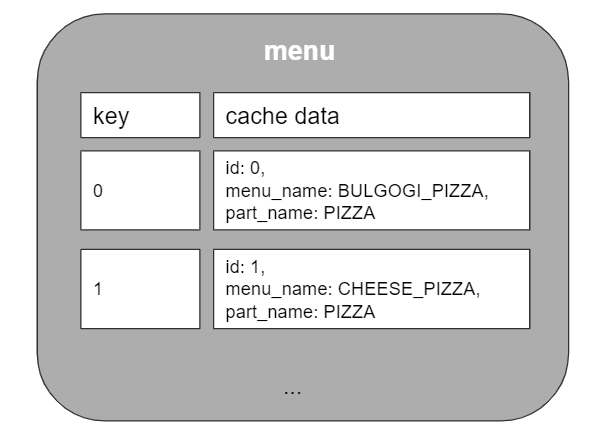

# Spring Cache
- 스프링 캐시에 대해 정리한 문서 및 예제 코드 레파지토리이다.
## Cache ?
- 자주 사용하는 데이터나 값을 미리 복사해 놓는 임시 장소를 뜻하며, 아래와 같은 저장공간 계층 구조에서 확인할 수 있듯이 캐시는 저장 공간이 작고 비용이 비싼 대신 빠른 성능을 제공한다.


## Spring Cache
- Spring에서 Cache는 다양한 저장소에 데이터를 Caching할 수 있는 기능을 제공한다. 또한 저장소에 독립적이고 추상화된 Caching 메커니즘을 제공한다. AOP 기반의 애너테이션을 제공하여 간편하게 Caching 기능을 운영 중인 애플리케이션에 도입할 수 있다.

- Spring에서 Caching은 아래 그림과 같이 처리를 한다.


- Spring Cache에서는 아래 코드 기준으로는 그림과 같이 내부적 Key/Value 타입의 자료구조로 관리 되고 있다. (출처: https://pamyferret.tistory.com/8)
```
@Service
@RequiredArgsConstructor
@Transactional
public class MenuService {
	private final MenuListRepository menuListRepository;
	
	// 메뉴 가져오기
	@Transactional(readOnly = true)
   	@Cacheable("menu")
	public List<MenuList> getMenuList() {
		return this.menuListRepository.findAll();
	}
    
    	// 메뉴 하나 가져오기
	@Transactional(readOnly = true)
	@Cacheable(value = "menu", key = "#id")
	public MenuList getOneMenu(int id) {
		return this.menuListRepository.findById(id).orElseThrow();
	}
}
```


## 브랜치 설명
### nonRedis 브랜치
- Caching할 데이터를 Redis가 아닌 Spring Boot Server 내부 메모리에서 관리 하는 방법을 알기 위한 샘플코드
### useRedis 브랜치
- Caching할 데이터를 Redis메모리에서 관리 하는 방법을 알기 위한 샘플코드

